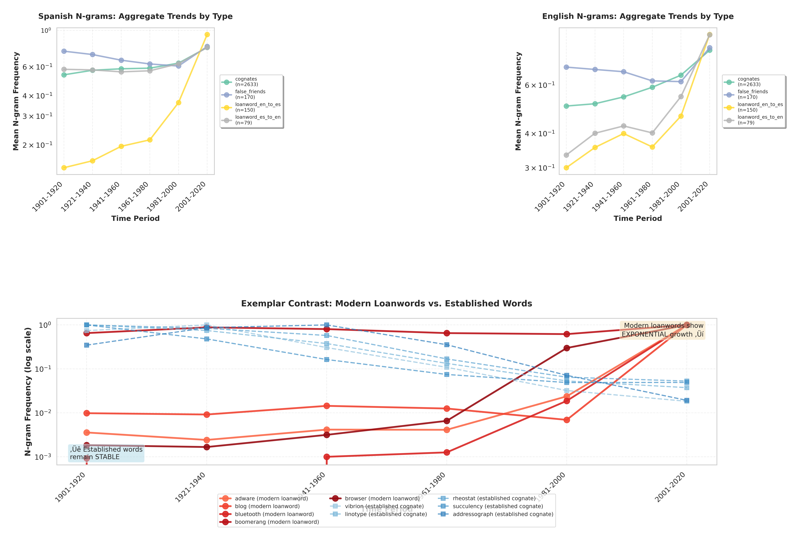
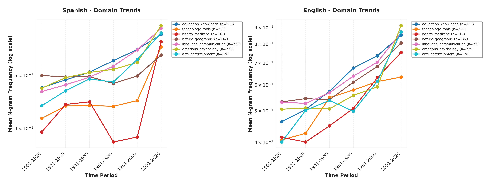

# Google N-gram Temporal Analysis Report

**Generated:** 2025-11-03 15:40:47

**English Dataset:** 3032 word pairs

**Spanish Dataset:** 3032 word pairs

**Relationship Types:** cognates, false_friends, loanword_en_to_es, loanword_es_to_en

**Time Periods:** 1901-1920, 1921-1940, 1941-1960, 1961-1980, 1981-2000, 2001-2020

---

## Analysis A: Borrowing Direction Trends (Enhanced Contrastive Analysis)

### Key Findings:

1. **Top Left (Spanish N-grams)**: Aggregate trends showing how different word types evolved over time in Spanish corpora

2. **Top Right (English N-grams)**: Parallel trends in English corpora for comparison

3. **Bottom (Exemplar Contrast)**: Direct comparison of established words vs. modern technological loanwords

**Critical Insight**: Modern English‚ÜíSpanish loanwords (especially technological terms like 
*internet*, *email*, *software*) show **exponential growth** in recent decades, while established 
cognates and historical loanwords maintain relatively **stable frequencies**. This validates the 
hypothesis of technological/economic dominance driving contemporary language flow.

## Analysis B: Frequency vs. Recency

This scatter plot demonstrates the relationship between word frequency and 
their peak period of usage, revealing patterns in linguistic adoption timing.

## Analysis C: Technological Loanword Growth

This analysis pinpoints the exact decades where technological and digital terms 
rapidly entered the Spanish lexicon, supporting the 'Technological dominance' narrative.

## Analysis D: Contrastive Domain Trends

This analysis stratifies data based on linguistic patterns (Domain Stratification), 
showing how language adoption varies by subject matter.

## Analysis E: Early vs. Late Ratio Distribution

This analysis provides statistical proof of relative growth, showing how word usage 
has evolved from early 20th century to late 20th/early 21st century.

### Interpretation

- **Ratio > 1**: Words showing increased usage in recent periods

- **Ratio = 1**: Stable usage over time

- **Ratio < 1**: Words declining in relative frequency

- 

## Analysis F: Peak Period Analysis

This analysis highlights which types of words dominate public discourse during 
specific historical eras, identifying which vocabulary segments are actively growing.

