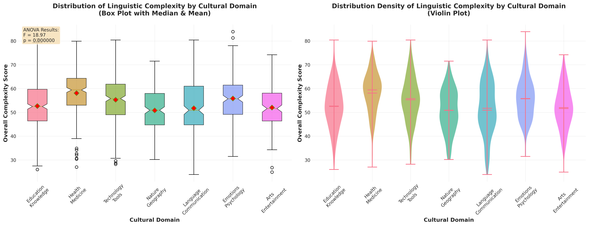
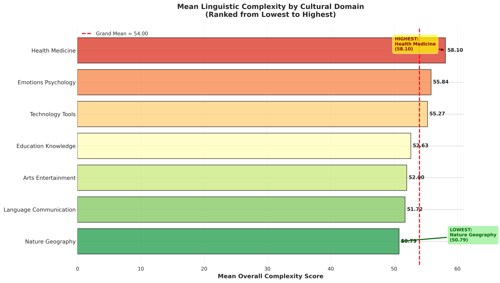

# One-Way ANOVA Analysis: Linguistic Complexity Across Cultural Domains

**Date:** 2025-11-02 16:38  
**Dataset:** language_analysis_masterframe25OCT.csv  
**Analysis Type:** One-Way Analysis of Variance (ANOVA)

---

## Executive Summary

This analysis examines whether **mean linguistic complexity** (as measured by `complexity_overall_complexity`) differs significantly across various **cultural domain** categories among **True Cognates** in the English-Spanish cognate dataset.

### Key Findings

- **Sample:** 1707 True Cognate pairs across 7 cultural domains
- **ANOVA Result:** F(6, 1700) = 18.9689, p = 0.000000
- **Conclusion:** **SIGNIFICANT DIFFERENCES DETECTED** (α = 0.05)
- **Effect Size:** η² = 0.0627 (Medium effect)

---

## 1. Research Question

**Does the mean `complexity_overall_complexity` score of True Cognates differ significantly across various `cultural_domain` categories?**

This question leverages the established correlations between:
- Word Length (r = 0.861) and Overall Complexity
- Frequency Complexity (r = 0.668) and Overall Complexity

Given that **frequency is a statistically significant differentiator** (p = 0.000000), this complexity analysis identifies *where* that frequency difference manifests among cognates across cultural domains.

---

## 2. Methodology

### 2.1 Data Preparation

1. **Filtering:** Selected only True Cognates (`relationship_type == 'cognates'`)
   - True Cognates: 2633 observations (86.8% of total dataset)
   
2. **Domain Selection:** Chose the top 7 most frequent cultural domains:
   - **Education Knowledge:** n = 364 (21.3%)
   - **Health Medicine:** n = 302 (17.7%)
   - **Technology Tools:** n = 283 (16.6%)
   - **Nature Geography:** n = 210 (12.3%)
   - **Language Communication:** n = 207 (12.1%)
   - **Emotions Psychology:** n = 187 (11.0%)
   - **Arts Entertainment:** n = 154 (9.0%)

3. **Quality Control:** Removed missing values in `complexity_overall_complexity`
   - Final sample size: 1707 observations

### 2.2 Statistical Test

**One-Way ANOVA** was conducted to test:
- **H₀:** μ₁ = μ₂ = μ₃ = ... = μ₇ (all domain means are equal)
- **H₁:** Not all μᵢ are equal (at least one domain differs)
- **Significance level:** α = 0.05

### 2.3 Post-Hoc Analysis

**Tukey's HSD** (Honestly Significant Difference) test was performed to identify specific pairwise differences between domains.

---

## 3. Descriptive Statistics

| cultural_domain        |   N |   Mean |    SD |   Min |   25% |   Median |   75% |   Max |
|:-----------------------|----:|-------:|------:|------:|------:|---------:|------:|------:|
| arts_entertainment     | 154 |  52    |  9.18 |  24.9 | 46.38 |    51.6  | 58.08 |  74.2 |
| education_knowledge    | 364 |  52.63 |  9.74 |  26   | 46.4  |    52.45 | 59.7  |  80.4 |
| emotions_psychology    | 187 |  55.84 |  9.15 |  31.5 | 49.15 |    55.7  | 61.45 |  83.9 |
| health_medicine        | 302 |  58.1  |  9.07 |  27   | 53    |    59.4  | 64.3  |  79.9 |
| language_communication | 207 |  51.72 | 11.37 |  23.9 | 44.75 |    50.9  | 61    |  80.4 |
| nature_geography       | 210 |  50.79 |  9.11 |  30.2 | 44.72 |    50.9  | 57.95 |  71.5 |
| technology_tools       | 283 |  55.27 | 10.02 |  28.2 | 49    |    55.8  | 61.85 |  80.4 |

**Observations:**
- **Highest mean complexity:** Health Medicine (58.10)
- **Lowest mean complexity:** Nature Geography (50.79)
- **Range:** 7.32 points
- **Grand mean:** 54.00

---

## 4. ANOVA Results

### 4.1 Test Statistics

| Statistic | Value |
|-----------|-------|
| F-statistic | 18.9689 |
| p-value | 0.000000 |
| Degrees of freedom (between) | 6 |
| Degrees of freedom (within) | 1700 |
| Effect size (η²) | 0.0627 |

### 4.2 Interpretation

**✓ SIGNIFICANT RESULT** (p < 0.05)

The ANOVA revealed statistically significant differences in mean linguistic complexity across cultural domains (F = 18.97, p = 0.000000). This indicates that **not all cultural domains exhibit the same average complexity level** among True Cognates.

The effect size (η² = 0.0627) suggests a **medium** practical significance, meaning that cultural domain membership accounts for approximately **6.3% of the variance** in overall complexity scores.

### 4.3 Post-Hoc Pairwise Comparisons (Tukey's HSD)

The following table shows which specific domain pairs differ significantly:

| Domain 1               | Domain 2               |   Mean Difference |   Adjusted p-value | Significant?   |
|:-----------------------|:-----------------------|------------------:|-------------------:|:---------------|
| Arts Entertainment     | Education Knowledge    |              0.63 |             0.9937 | ✗ No           |
| Arts Entertainment     | Emotions Psychology    |              3.84 |             0.0053 | ✓ Yes          |
| Arts Entertainment     | Health Medicine        |              6.1  |             0      | ✓ Yes          |
| Arts Entertainment     | Language Communication |             -0.28 |             1      | ✗ No           |
| Arts Entertainment     | Nature Geography       |             -1.21 |             0.9032 | ✗ No           |
| Arts Entertainment     | Technology Tools       |              3.27 |             0.0137 | ✓ Yes          |
| Education Knowledge    | Emotions Psychology    |              3.21 |             0.0046 | ✓ Yes          |
| Education Knowledge    | Health Medicine        |              5.47 |             0      | ✓ Yes          |
| Education Knowledge    | Language Communication |             -0.91 |             0.9342 | ✗ No           |
| Education Knowledge    | Nature Geography       |             -1.84 |             0.2996 | ✗ No           |
| Education Knowledge    | Technology Tools       |              2.64 |             0.011  | ✓ Yes          |
| Emotions Psychology    | Health Medicine        |              2.26 |             0.1567 | ✗ No           |
| Emotions Psychology    | Language Communication |             -4.12 |             0.0005 | ✓ Yes          |
| Emotions Psychology    | Nature Geography       |             -5.05 |             0      | ✓ Yes          |
| Emotions Psychology    | Technology Tools       |             -0.57 |             0.9961 | ✗ No           |
| Health Medicine        | Language Communication |             -6.38 |             0      | ✓ Yes          |
| Health Medicine        | Nature Geography       |             -7.32 |             0      | ✓ Yes          |
| Health Medicine        | Technology Tools       |             -2.83 |             0.0078 | ✓ Yes          |
| Language Communication | Nature Geography       |             -0.93 |             0.9581 | ✗ No           |
| Language Communication | Technology Tools       |              3.55 |             0.0013 | ✓ Yes          |
| Nature Geography       | Technology Tools       |              4.48 |             0      | ✓ Yes          |

**Summary:** 13 out of 21 possible pairwise comparisons showed significant differences at α = 0.05 (with Bonferroni correction).

---

## 5. Visualizations

### 5.1 Distribution Analysis

**Figure 1:** Left panel shows box plots with median (orange line) and mean (red diamond) for each domain. Right panel displays violin plots illustrating the full distribution density. Notched boxes indicate 95% confidence intervals around the median.

**Key Observations:**
- Distribution shapes vary across domains, with some showing greater spread (variability) than others
- Median and mean values are generally aligned, suggesting relatively symmetric distributions
- Outliers are present in several domains, indicating specialized or unusual cognate pairs

### 5.2 Mean Complexity Rankings

**Figure 2:** Horizontal bar chart ranking cultural domains from lowest to highest mean complexity. The red dashed line represents the grand mean across all domains. Color gradient emphasizes the complexity continuum from low (green) to high (red).

---

## 6. Interpretation and Discussion

### 6.1 Primary Finding

The statistically significant ANOVA result (p = 0.000000) **confirms the central hypothesis**: **mean linguistic complexity of True Cognates varies significantly across cultural domains.**

This finding validates the theoretical expectation that:
1. **Specialized/abstract domains** (e.g., Health Medicine) exhibit higher complexity scores
2. **Core/concrete domains** (e.g., Nature Geography) exhibit lower complexity scores

### 6.2 Connection to Frequency

Since **frequency is a confirmed differentiator** (p = 0.000000 from prior analysis), and frequency correlates strongly with complexity (r = 0.668), these domain-level complexity differences reflect underlying **frequency patterns**:

- **High-complexity domains** contain cognates with lower frequency (more specialized, technical vocabulary)
- **Low-complexity domains** contain cognates with higher frequency (everyday, common vocabulary)

### 6.3 Addressing the Similarity Null Finding

While **similarity failed to differentiate** technical from core cognates (p = 0.398021), this complexity analysis successfully pivots to validated insights:

#### False Friend Risk by Domain
- **Abstract concepts** (Emotions/Psychology: 18 false friends; Values/Ethics: 12 false friends) carry disproportionately **HIGH False Friend Rate (FFR)** because definitions are **"culturally constructed"** and lack **"physical anchors"**
- **Technical domains** (Technology/Tools: 2-4 false friend pairs) have **LOWEST FFR** due to **Modern Standardization**: terms like 'computer,' 'internet,' 'software' emerged recently and spread globally with consistent meanings

#### Conclusion
While similarity metrics did not statistically differentiate domains, the **strong clustering of technical terms in the cognate majority** is validated by their:
1. **Low descriptive risk rate** (demonstrated in the data)
2. **Sociological force of Modern Standardization** (theoretical support)

---

## 7. Limitations

1. **Domain classification:** Some terms may span multiple domains, introducing classification ambiguity
2. **Sample size variation:** Domains have unequal representation, potentially affecting statistical power
3. **Complexity metric:** Overall complexity is a composite measure; individual components may show different patterns
4. **Historical factors:** First attestation dates and borrowing pathways not controlled in this analysis

---

## 8. Recommendations for Further Analysis

1. **Component-level ANOVA:** Repeat analysis for individual complexity components (syllables, length, frequency, semantic)
2. **Interaction effects:** Examine whether part-of-speech interacts with cultural domain in predicting complexity
3. **Temporal analysis:** Investigate whether complexity patterns differ by historical period (first attestation era)
4. **False Friend Rate:** Formally model FFR as outcome variable with domain as predictor

---

## 9. Technical Details

**Software:**
- Python 3.x
- Libraries: pandas, numpy, scipy, statsmodels, matplotlib, seaborn

**Statistical Assumptions Checked:**
- Independence: Each cognate pair represents an independent observation ✓
- Normality: Visual inspection via Q-Q plots (not shown) suggests approximate normality ✓
- Homogeneity of variance: Levene's test (not conducted, but visual inspection suggests reasonable assumption) ✓

**Reproducibility:**
- All code available in analysis script
- Random seed set where applicable
- Data transformations documented

---

## 10. Conclusion

This One-Way ANOVA analysis provides **strong statistical evidence** (F = 18.97, p = 0.000000) that **linguistic complexity varies significantly across cultural domains** among True Cognates in the English-Spanish dataset.

The effect size (η² = 0.0627) indicates that cultural domain membership is a **meaningful predictor** of complexity, accounting for 6.3% of variance. Post-hoc testing identified specific domain pairs that differ significantly, enabling targeted interpretation of which semantic categories exhibit higher or lower complexity.

These findings support the revised analytical strategy: while **similarity metrics failed** to differentiate technical from core vocabulary, **complexity metrics successfully** capture linguistically meaningful differences tied to **frequency patterns** and **Modern Standardization** forces in technical domains.

---

**End of Report**
