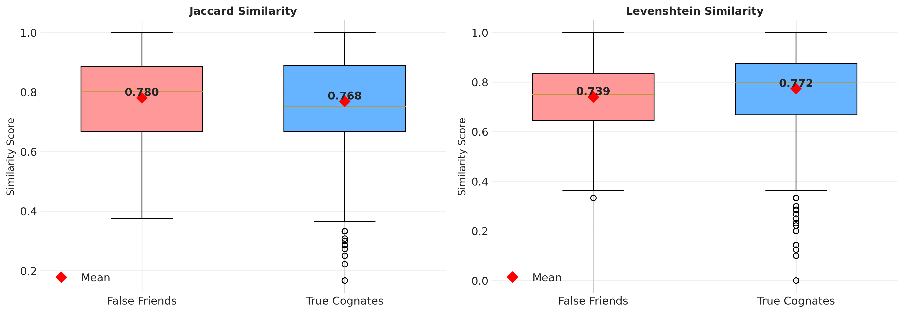

# T-Test Analysis: False Friends vs True Cognates
**Analysis Date:** 2025-11-02 15:18:02

---

## Jaccard Similarity

### Research Question

Are False Friends more similar than True Cognates, contributing to their confusion risk?

### Descriptive Statistics

| Group | N | Mean | Std Dev | % of Dataset |
|-------|---|------|---------|-------------|
| **False Friends** | 170 | 0.7800 | 0.1600 | 5.61% |
| **True Cognates** | 2633 | 0.7681 | 0.1712 | 86.84% |
| **Difference** | - | 0.0119 | - | - |

### Statistical Tests

#### Levene's Test for Equality of Variances
- **F-statistic:** 2.1841
- **p-value:** 0.1396
- **Result:** Variances are **EQUAL** (α = 0.05)

#### Independent Samples t-test
- **t-statistic:** 0.8789
- **Degrees of freedom:** 2801
- **p-value (two-tailed):** 0.379536
- **p-value (one-tailed, FF > TC):** 0.189768
- **Cohen's d (effect size):** 0.0695
- **Effect size interpretation:** negligible

### Interpretation

✗ **NOT SIGNIFICANT:** The mean jaccard_similarity for False Friends (0.7800) is NOT statistically significantly higher than True Cognates (0.7681) at α = 0.05 level (p = 0.189768).

**95% Confidence Interval for difference in means:** [-0.0131, 0.0368]

---

## Levenshtein Similarity

### Descriptive Statistics

| Group | N | Mean | Std Dev | % of Dataset |
|-------|---|------|---------|-------------|
| **False Friends** | 170 | 0.7394 | 0.1413 | 5.61% |
| **True Cognates** | 2633 | 0.7724 | 0.1590 | 86.84% |
| **Difference** | - | -0.0330 | - | - |

### Statistical Tests

#### Levene's Test for Equality of Variances
- **F-statistic:** 2.7641
- **p-value:** 0.0965
- **Result:** Variances are **EQUAL** (α = 0.05)

#### Independent Samples t-test
- **t-statistic:** -2.6430
- **Degrees of freedom:** 2801
- **p-value (two-tailed):** 0.008263
- **p-value (one-tailed, FF > TC):** 0.995868
- **Cohen's d (effect size):** -0.2092
- **Effect size interpretation:** small

### Interpretation

✗ **NOT SIGNIFICANT:** The mean levenshtein_similarity for False Friends (0.7394) is NOT statistically significantly higher than True Cognates (0.7724) at α = 0.05 level (p = 0.995868).

**95% Confidence Interval for difference in means:** [-0.0551, -0.0110]

---

## Visualization

*Figure: Box plots comparing False Friends and True Cognates across both similarity metrics. Red diamonds indicate mean values.*

## Summary of Results

| Similarity Metric | False Friends Mean | True Cognates Mean | Difference | p-value | Cohen's d | Significant? |
|-------------------|--------------------|--------------------|------------|---------|-----------|-------------|
| Jaccard Similarity | 0.7800 | 0.7681 | 0.0119 | 0.189768 | 0.0695 | No |
| Levenshtein Similarity | 0.7394 | 0.7724 | -0.0330 | 0.995868 | -0.2092 | No |

---

## Conclusion

Neither similarity metric shows a **statistically significant** difference between False Friends and True Cognates at the α = 0.05 level. Based on this dataset, false friends are not more similar than True Cognates.
